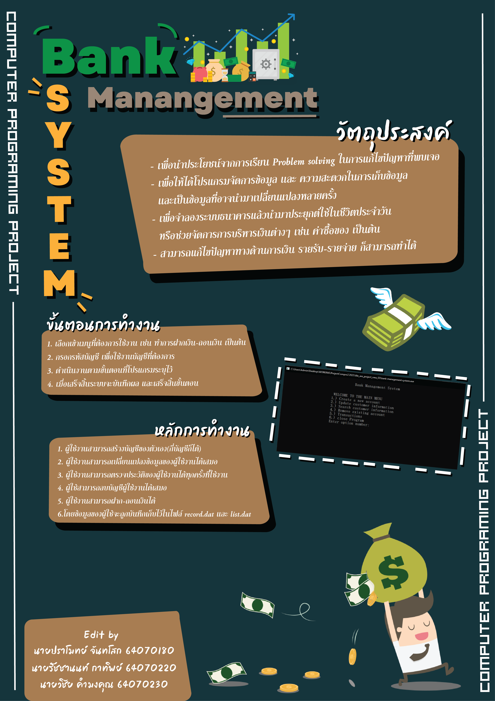

# Bank Management System
> Project Computer Programming
# บทคัดย่อ
> [บทคัดย่อ](https://docs.google.com/document/d/1yAhsaE5xrhK6O9AWhR-B6Jkuzf1IUlZ4Hnu-8HcaP2g/edit?usp=sharing)
# ที่มา
  > ...
# วัตถุประสงค์
> เพื่อนำประโยชน์จากการเรียน Problem solving ในการแก้ไขปัญหาที่พบเจอ เพื่อให้ได้โปรแกรมจัดการข้อมูล เเละ ความสะดวกในการเก็บข้อมูลเเละเป็นข้อมูลที่อาจนำมาเปลี่ยนแปลงหลายครั้ง เพื่อจำลองระบบธนาคารแล้วนำมาประยุกต์ใช้ในชีวิตประจำวัน  หรือช่วยจัดการการบริหารเงินต่างๆ เช่น ค่าซื้อของ เป็นต้น และสามารถแก้ไขปัญหาทางด้านการเงิน รายรับ-รายจ่าย ก็สามารถทำได้
# ประโยชน์ที่ได้รับ
> * ...
> * ...
# โปรแกรม และภาษาที่ใช้
> * ...
# Video
> [Bank Management System | Computer Programming Project](https://youtu.be/dQw4w9WgXcQ)
# โปสเตอร์
>  
## สมาชิก
---

| No.Student | Name |  Working |
| :-------- | :-------- | :--------- |
|   64070180   |   ปราโมทย์ จันทโสก   |    Video & Poster & Github   |
|   64070220   |   รัชชานนท์ กาทิพย์   |    Poster & Github   |
|   64070230   |   วิชัย คำมงคุณ   |    Video & Coding   |
